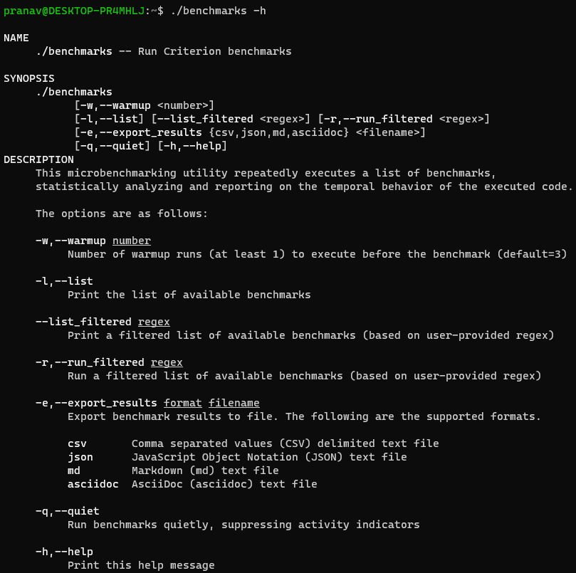

<p align="center">
    
</p> 

<p align="center">
    
</p> 

## Highlights

`Criterion` is a micro-benchmarking library for modern C++.

* Convenient static registration macros for setting up benchmarks
* Parameterized benchmarks (e.g., vary input size)
* Statistical analysis across multiple runs
* Requires compiler support for `C++17` or newer standard
* Header-only library - single header file version available at `single_include/`
* MIT License

## Table of Contents

*    [Getting Started](#getting-started)
     *    [Simple Benchmark](#simple-benchmark)
     *    [Passing Arguments](#passing-arguments)
     *    [Passing Arguments (Part 2)](#passing-arguments-part-2)
     *    [CRITERION_BENCHMARK_MAIN](#CRITERION_BENCHMARK_MAIN)
     *    [Exporting Results (csv, json etc.)](#exporting-results-csv-json-etc)
*    [Building Library and Samples](#building-library-and-samples)
*    [Generating Single Header](#generating-single-header)
*    [Contributing](#contributing)
*    [License](#license)

## Getting Started

Let's say we have this merge sort implementation that needs to be benchmarked.

```cpp
template<typename RandomAccessIterator, typename Compare>
void merge_sort(RandomAccessIterator first, RandomAccessIterator last,
                Compare compare, std::size_t size) {
  if (size < 2) return;
  auto middle = first + size / 2;
  merge_sort(first, middle, compare, size / 2);
  merge_sort(middle, last, compare, size - size/2);
  std::inplace_merge(first, middle, last, compare);
}
```

### Simple Benchmark

Include `<criterion/criterion.hpp>` and you're good to go.

* Use the `BENCHMARK` macro to declare a benchmark
* Use `SETUP_BENCHMARK` and `TEARDOWN_BENCHMARK` to perform setup and teardown tasks
  - These tasks are not part of the measurement

```cpp
#include <criterion/criterion.hpp>

BENCHMARK(MergeSort)
{
  SETUP_BENCHMARK(
    const auto size = 100;
    std::vector<int> vec(size, 0); // vector of size 100
  )
 
  // Code to be benchmarked
  merge_sort(vec.begin(), vec.end(), std::less<int>(), size);
  
  TEARDOWN_BENCHMARK(
    vec.clear();
  )
}

CRITERION_BENCHMARK_MAIN()
```

<p align="center">
    
</p> 

What if we want to run this benchmark on a variety of sizes?

### Passing Arguments

* The `BENCHMARK` macro can take typed parameters
* Use `GET_ARGUMENTS(n)` to get the nth argument passed to the benchmark
* For benchmarks that require arguments, use `INVOKE_BENCHMARK_FOR_EACH` and provide arguments

```cpp
#include <criterion/criterion.hpp>

BENCHMARK(MergeSort, std::size_t) // <- one parameter to be passed to the benchmark
{
  SETUP_BENCHMARK(
    const auto size = GET_ARGUMENT(0); // <- get the argument passed to the benchmark
    std::vector<int> vec(size, 0);
  )
 
  // Code to be benchmarked
  merge_sort(vec.begin(), vec.end(), std::less<int>(), size);
  
  TEARDOWN_BENCHMARK(
    vec.clear();
  )
}

// Run the above benchmark for a number of inputs:

INVOKE_BENCHMARK_FOR_EACH(MergeSort,
  ("/10", 10),
  ("/100", 100),
  ("/1K", 1000),
  ("/10K", 10000),
  ("/100K", 100000)
)

CRITERION_BENCHMARK_MAIN()
```

<p align="center">
    
</p> 

### Passing Arguments (Part 2)

Let's say we have the following struct and we need to create a `std::shared_ptr` to it.

```cpp
struct Song {
  std::string artist;
  std::string title;
  Song(const std::string& artist_, const std::string& title_) :
    artist{ artist_ }, title{ title_ } {}
};
```

Here are two implementations for constructing the `std::shared_ptr`:

```cpp
// Functions to be tested
auto Create_With_New() { 
  return std::shared_ptr<Song>(new Song("Black Sabbath", "Paranoid")); 
}

auto Create_With_MakeShared() { 
  return std::make_shared<Song>("Black Sabbath", "Paranoid"); 
}
```

We can setup a single benchmark that takes a `std::function<>` and measures performance like below.

```cpp
BENCHMARK(ConstructSharedPtr, std::function<std::shared_ptr<Song>()>) 
{
  SETUP_BENCHMARK(
    auto test_function = GET_ARGUMENT(0);
  )

  // Code to be benchmarked
  auto song_ptr = test_function();
}

INVOKE_BENCHMARK_FOR_EACH(ConstructSharedPtr, 
  ("/new", Create_With_New),
  ("/make_shared", Create_With_MakeShared)
)

CRITERION_BENCHMARK_MAIN()
```

<p align="center">
    
</p> 

### CRITERION_BENCHMARK_MAIN

`CRITERION_BENCHMARK_MAIN()` provides a main function that:

1. Handles command-line arguments,
2. Runs the registered benchmarks
3. Exports results to file if requested by user.

Here's the help/man generated by the main function:

<p>
    
</p> 

### Exporting Results (csv, json, etc.)

Benchmarks can be exported to one of a number of formats: `.csv`, `.json`, `.md`, and `.asciidoc`.

Use `--export_results` (or `-e`) to export results to one of the supported formats.

```console
foo@bar:~$ ./vector_sort -e json results.json -q # run quietly and export to JSON

foo@bar:~$ cat results.json
{
  "benchmarks": [
    {
      "name": "VectorSort/100",
      "warmup_runs": 2,
      "iterations": 2857140,
      "mean_execution_time": 168.70,
      "fastest_execution_time": 73.00,
      "slowest_execution_time": 88809.00,
      "lowest_rsd_execution_time": 84.05,
      "lowest_rsd_percentage": 3.29,
      "lowest_rsd_index": 57278,
      "average_iteration_performance": 5927600.84,
      "fastest_iteration_performance": 13698630.14,
      "slowest_iteration_performance": 11260.12
    },
    {
      "name": "VectorSort/1000",
      "warmup_runs": 2,
      "iterations": 2254280,
      "mean_execution_time": 1007.70,
      "fastest_execution_time": 640.00,
      "slowest_execution_time": 102530.00,
      "lowest_rsd_execution_time": 647.45,
      "lowest_rsd_percentage": 0.83,
      "lowest_rsd_index": 14098,
      "average_iteration_performance": 992355.48,
      "fastest_iteration_performance": 1562500.00,
      "slowest_iteration_performance": 9753.24
    },
    {
      "name": "VectorSort/10000",
      "warmup_runs": 2,
      "iterations": 259320,
      "mean_execution_time": 8833.26,
      "fastest_execution_time": 6276.00,
      "slowest_execution_time": 114548.00,
      "lowest_rsd_execution_time": 8374.15,
      "lowest_rsd_percentage": 0.11,
      "lowest_rsd_index": 7905,
      "average_iteration_performance": 113208.45,
      "fastest_iteration_performance": 159337.16,
      "slowest_iteration_performance": 8729.96
    }
  ]
}
```

## Building Library and Samples

```bash
cmake -Hall -Bbuild
cmake --build build

# run `merge_sort` sample
./build/samples/merge_sort/merge_sort
```

## Generating Single Header

```bash
python3 utils/amalgamate/amalgamate.py -c single_include.json -s .
```

## Contributing
Contributions are welcome, have a look at the [CONTRIBUTING.md](CONTRIBUTING.md) document for more information.

## License
The project is available under the [MIT](https://opensource.org/licenses/MIT) license.
